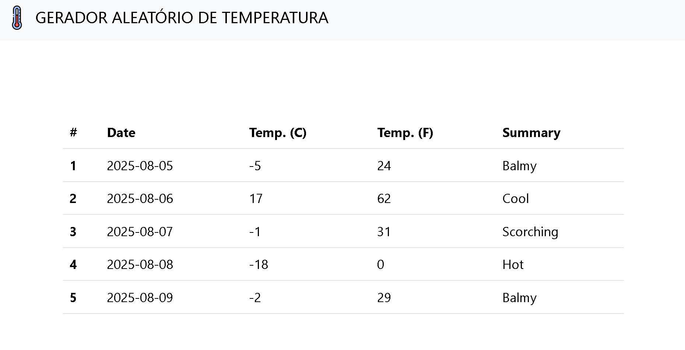
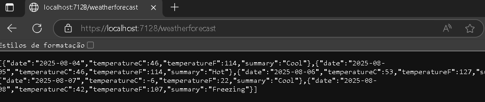

# Projeto Gerador Aleatório de Temperatura

Este projeto é uma aplicação web simples que utiliza **ASP.NET Core MVC** no backend e **React.js** no frontend, integrado em uma única solução. A interface utiliza **Bootstrap** para estilização.

---

## Funcionalidades

- Backend ASP.NET Core:
  - API simples que retorna previsões de temperatura (WeatherForecast).
  - Serve arquivos estáticos da aplicação React.
- Frontend React:
  - Exibe dados de previsão do tempo consumindo a API do backend.
  - Navbar responsiva com ícone e título.
  - Tabela estilizada com Bootstrap exibindo os dados da previsão.
  - Rodapé simples com informações do projeto.

---

## Tecnologias usadas

- **Backend:** ASP.NET Core 8.0 (Minimal API + Controllers)
- **Frontend:** React 19 + Bootstrap 5
- **Build e ferramentas:** Vite (ou CRA), npm/yarn

---

## Estrutura do projeto

/Server # Backend ASP.NET Core
Controllers/
WeatherForecastController.cs
WeatherForecast.cs
Program.cs # Configuração e inicialização da API

/client # Frontend React
src/
components/
NavBar.jsx
Tabel.jsx
FooterBar.jsx
App.jsx
main.jsx
package.json

/images # Prints de tela
front1.png # Captura de tela do frontend (home)
front2.png # Outra visão do frontend (tabela)
back1.png # JSON retornado pelo backend

.gitignore
README.md
